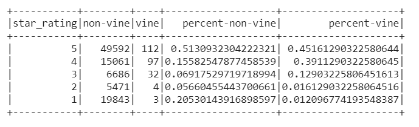
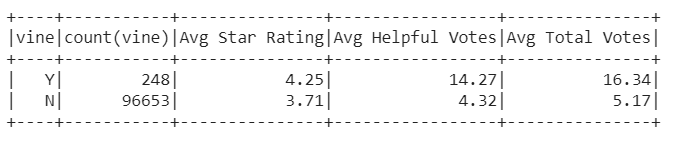
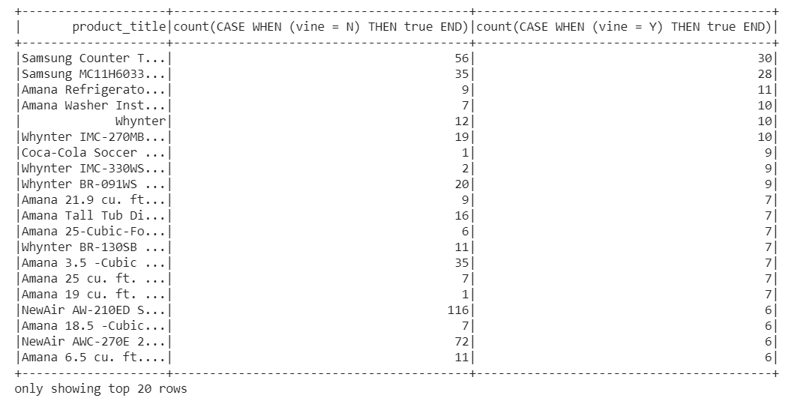
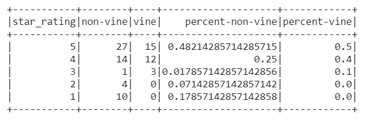
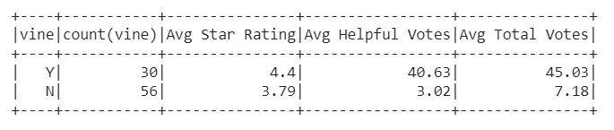
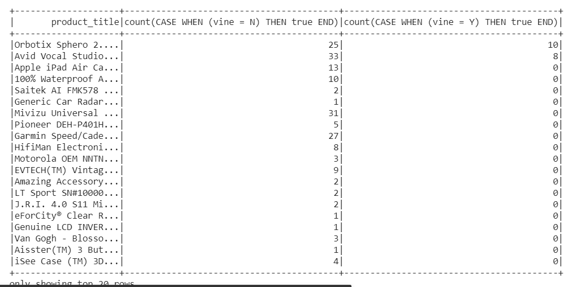
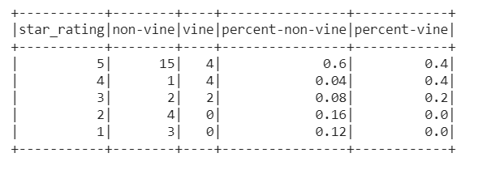
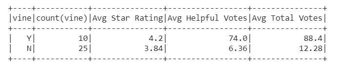

# Cloud-ETL-Amazon-Reviews
Big Data is often so large that it can exceed the capacity of local machines to handle. This project is built to perform the ETL process completely in the cloud and upload a DataFrame to an RDS instance. The second goal will be to use PySpark to perform a statistical analysis of Amazon's Vine program wherein reviewers receive free products in exchange for reviews. Even though Amazon has several policies to reduce the bias of its Vine reviews: [https://www.amazon.com/gp/vine/help?ie=UTF8](https://www.amazon.com/gp/vine/help?ie=UTF8), the analysis is to check whether if they are actually trustworthy.

## Tools and Technologies Used and Required to Run the Project
* Google Colaboratory
* AWS Redshift (RDS)
* PostgreSQL and PG Admin 4

## Data Source
Amazon makes it's product reviews data available publicly [here](https://s3.amazonaws.com/amazon-reviews-pds/tsv/index.txt)

## How to Run the project
1. Create an AWS account [here](https://aws.amazon.com/) if you don't have already and login to console.
2. Create a new instance of Postgres database in AWS RDS, make sure to modify public accessibility to "Yes".
3. In the database instance, go to security group and edit inbound rules, add a new rule with Type: Postgres and Source: All.
4. Copy the endpoint address of the database and launch PG Admin 4.
5. Create a new server in PG Admin 4 and in the connection tab on the dialog box, paste the copied address under Host Name/address
6. Create a new database "amazon-sentiments" in the server and open query tool, copy paste the code from [schema.sql](schema.sql) and run it.
7. Download both or any one of the jupyter notebooks from the repository.
8. Open Google Colaboratory, upload one of the jupyter notebooks and enter your endpoint address and RDS password in the 13th cell.
9. Go to Runtime tab and Run all.
    * Note:- Currently the project is on Mobile electronics and Major Appliances, you can change to any other product category by copying the desired link [from here](https://s3.amazonaws.com/amazon-reviews-pds/tsv/index.txt) and pasting it as url in the third cell in your Colab Notebook. 

## Observations and Findings

### Major Appliances
1. When looked at total percent of vine and non-vine review's star rating, it does not seem to be biased as in fact non-vine reviews have higher 5 star rating than vine reviews 

2. Even though average rating of vine reviews is higher by 0.54 stars, the helpful votes are also higher, since the difference is not very significant, looking at this it can be said that they are not biased.

3. The data was then further explored to check if there's a particular product bias. Hence, the products were sorted in descending order on count of vine reviews. The top vine reviewed product was picked, that is "Samsung Counter Top Microwave".

There were total 11,694 product categories in total, but more than 12% vine reviews were given on a single product.

4. When looked at star distribution of the particular product, it was not rated 2 or 1 stars even **once** by vine reviewers and 90% of the reviews were 4 stars and above. This clearly shows bias of the vine reviews in case of a particularly advertised product.

5. In case of the particular product, the average rating of vine reviews was higher by **0.61 stars**. 
* Even though helpful/total votes were way higher but fake votes might have affected, because as noticed, always the average votes of vine reviews are higher. 

* Also, as per Amazon's algorithm, by default, Top rated reviews are shown first and hence, votes have a very high impact on forming opinion based on reviews.

### Mobile Electronics

A similar pattern was also noticed in case of Mobile Electronics.
1. Of total 25,801 products, all vine reviews were on only 2 products

2. When looked at star distribution of the particular product, it was not rated 2 or 1 stars even **once** by vine reviewers and 80% of the reviews were 4 stars and above. This clearly shows bias of the vine reviews in case of a particularly advertised product.

3. Average rating was higher by 0.36 stars.

* Even though helpful/total votes were way higher but fake votes might have affected, because as noticed, always the average votes of vine reviews are higher. 

* Also, as per Amazon's algorithm, by default, Top rated reviews are shown first and hence, votes have a very high impact on forming opinion based on reviews.

